# Virtual Rounding Power Apps Deployment Instructions

Below are instructions for deploying the Power Apps provided from the KiZAN repository as of April 17, 2020.

If your installation account has not yet been granted a Power Automate entitlement, check out the [Power Automate pricing page](https://flow.microsoft.com/pricing/), and click "Try free". If you can't get this to work, you may be able to talk to your Microsoft Account Team on getting a COVID-19 related trial of the platform.

## SharePoint List Permissions

1. Update the Virtual Rounding list so that all Providers have "Edit" access to the list items.
2. If you desire for Patients to be able to conduct "Invites" from their devices, Room Accounts will need "Edit" access to their list items. Note that doing this could be a PHI exposure avenue if Patient devices are not locked down to Kiosk mode; as users could leverage the Web Browser to navigate to the SharePoint site and view other rooms' data.  (A pending Provision Meetings script Flow update may be able to address this via item-level permissions... Stay Tuned)

## Initial Provider App Upload

1. Navigate to the Power Apps portal signed in as a user with a Premium Power Automate license assigned to them. Click on "Import" and Upload the VirtualRounding_xxxxx.zip file.
2. Set "Import Setup" for App as "Create as new"

    

3. Each of the Flows within the "Related Resources" should be configured with "Create as new".  Note, that if you don't see "Set Patient Name", do not worry, this has been removed in later iterations of the Power App. 

    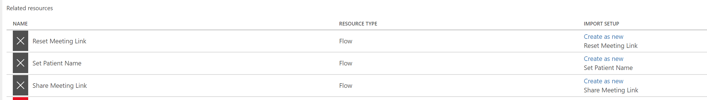

4. Create a SharePoint Connection and Mail Connection (if one doesn't already exist) respectively.
5. Click "Import"
6. You should see a success indicator upon completion.

    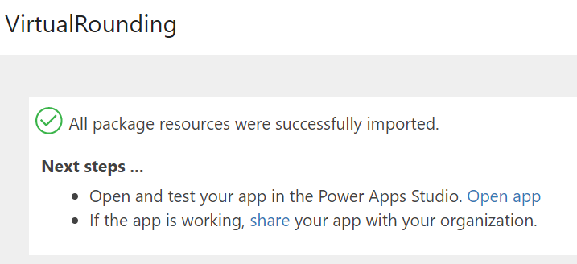

7. Open the uploaded App in "Edit" mode, and click on the "Data" icon on the left hand side of the interface.

8. Expand the previous "Virtual Rounding" data source and click "Remove. Expect to see a lot of warnings pop up in your Health indicator.

    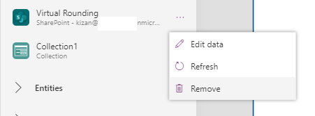

9. In the "Data sources" pane, expand out "Connectors", and click on your SharePoint connector.

    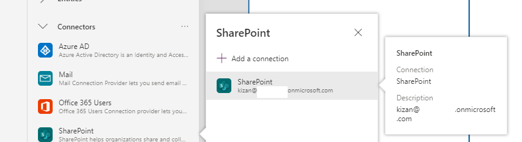

10. Connect to your Virtual Rounding site (the v2 one) and select the Virtual Rounding list. If this list was imported as "Virtual Rounding", you're good to go!  If you chose an alternative name; you will need to replace references to 'Virtual Rounding' in the Power App formulas with the name of your list.
11. Share the App "File... Share within the Power Apps studio" with any Providers who will need access to it (this should be via AAD group for larger deployments).  You will probably want to un-select the "Send email" prompt until you are ready to share it with the users.

## Room Join Power App Field Reference Updates (Not be necessary in v2.1 Apps)

This is not necessary in the Power App provided by KiZAN on this repository as of April 22, 2020. You may skip on down to "Update Power Automate Flows"

1. Open the Provider Power App in Edit Mode in Power Apps
2. Navigate to the "Configuration" screen.
3. Select the "FormViewer1" control, and on "Fields" click "Edit fields"
4. Remove the "Shared to (custom) field.
5. Click "Add Field" and Select "Shared With". (If this interface is grayed out, you may need to click on the "Data source drop down and re-select "Virtual Rounding", even if it's already selected) 

    

6. Update the "Set Name" button's OnSelect Action with the below formula:
   Patch('Virtual Rounding', RoomGallery.Selected, {'Patient Name': PatientName.Text}) ;Navigate(Complete,ScreenTransition.Fade)
7. Update the "Clear Name" button's OnSelect Action with the below formula:
    Patch('Virtual Rounding', RoomGallery.Selected, {'Patient Name': ""}) ;Navigate(Complete,ScreenTransition.Fade)
8. Navigate to the "Joining Room" screen, and select the "This room meeting has been shared with 1 external participant(s) label.
9. Replace this label's text attribute with the below formula:
   Concatenate("This room meeting has been shared with ", Text(RoomGallery.Selected.SharedWith), " external participant(s).")

## Updating Power Automate Flows

1. Navigate to [Flow](https://flow.microsoft.com) and sign into the system.
2. You can safely delete the "Update Patient Name" Flow if you see it here, as we're using PATCH statements to replace it now.
3. Click "Reset Meeting Link" and edit this flow.
4. On the first "Get item" step, update the step to refer to your Virtual Rounding site/list. Type-ahead on this will likely not work since the Flow was imported, click the "Limit Columns by View" to confirm that you got the URL and List Names correct

    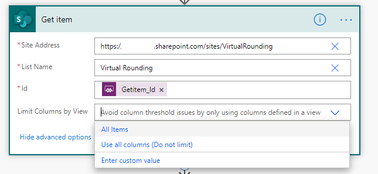

5. Populate the client Secret, Application Id, Directory Id, Hours off UTC and Set Time Zone steps with the proper information.
6. Expand the "Create Teams Meeting Link" activity.  Update "Room_x0020_UPN" with "Room UPN" (This step was automatically completed in v2.1)

    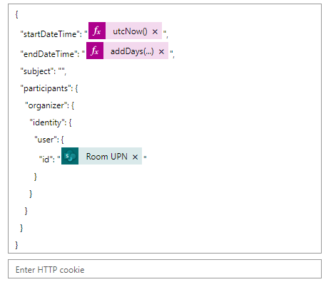

7. Expand the "Update Calendar Event" activity. Update the reference to "Room_xx0020_UPN" with "Room UPN" (This step was automatically completed in 2.1)

    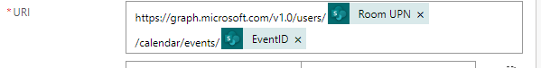

8. Expand the "Update Item" activity. Replace the Site Address and List Name with your site's information.
9. Ensure the columns below are populated with the correct information below.  There may be "left over" column names like FamilyInvited or "Room_x0020_UPN", which you can ignore (and will eventually decide to go away from the editor)

    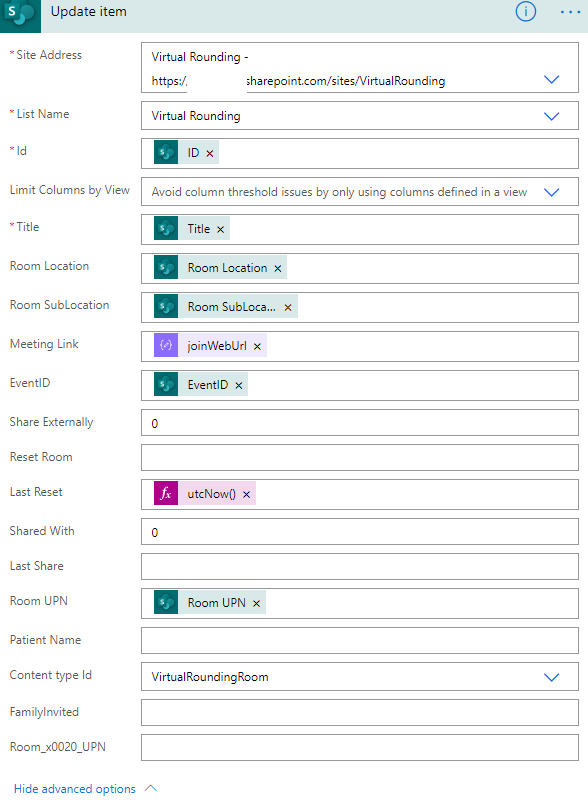

10. Save the Flow, and run a test from the Power App to confirm that patient data, meeting invites, etc. are refreshed inside of the underlying SharePoint Virtual Rounding list.
11. Click the "Share Meeting Link" Flow and edit the flow.
12. On the first "Get item" step, update the step to refer to your Virtual Rounding site/list. (See step 4)
13. Confirm that the "Send an email notification" has the proper message content for your organization. (Some organizations prefer to replace this step with a "Send As" action within Exchange Online, or another mass-mailing platform.  The default action will have a "From" address of Send Grid and "Power Apps and Flow" that will frequently wind up in users' Spam folders.)
14. Update the "Update Item" action like in step 9 above. The formula for "Shared With" should be:
    add(body('Get_item')?['SharedWith'], 1)
15. Click "Save" and test this Flow from the Power App (remember, check your Spam folder)

If you start to get errors on Flows when testing them, remember sometimes it's easier to create a new one (and use the awesome new "Copy to clipboard" for each Flow action), than try to get a Flow with messed up connections patched up.

## Patient App Upload

1. Navigate to the Power Apps portal signed in as a user with a Premium Power Automate license assigned to them. Click on "Import" and Upload the PatientJoin_xxxxx.zip file.
2. Set "Import Setup" for App as "Create as new"
3. For Share Meeting Link, select "Create as New", otherwise we'll overwrite all of our hard work down on the previous steps to get the Meeting Link flow matched into your environment. In doing so, give it a name to denote it's temporary and able to be deleted in following steps.

    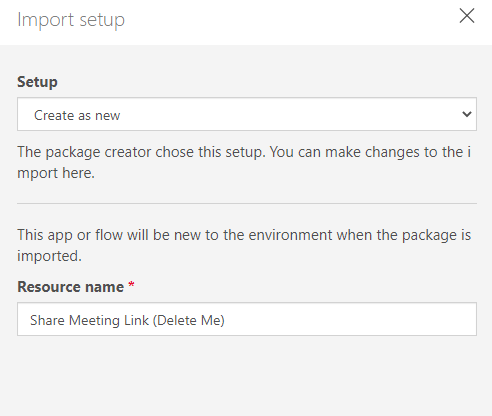

4. Update the SharePoint and Mail connections just like the Provider app.

    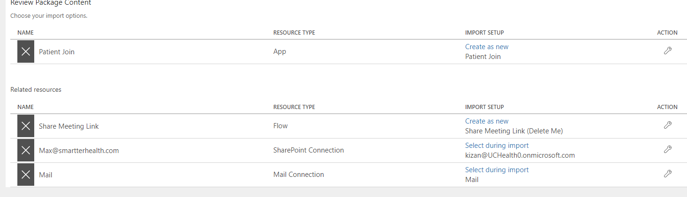

5. Click "Import"
6. You should see a success indicator upon completion.

    

7. Open the uploaded App in "Edit" mode, and click on the "Data" icon on the left hand side of the interface.

8. Expand the previous "Virtual Rounding" data source and click "Remove. Expect to see a lot of warnings pop up in your Health indicator.

    

9. In the "Data sources" pane, expand out "Connectors", and click on your SharePoint connector.

    

10. Connect to your Virtual Rounding site (the v2 one) and select the Virtual Rounding list. If this list was imported as "Virtual Rounding", you're good to go!  If you chose an alternative name; you will need to replace references to 'Virtual Rounding' in the Power App formulas with the name of your list.
11. Share the App with your VirtualRoundingRooms group you used to track all of your Rooms in AAD. You will  want to un-select the "Send email" prompt, as users will not be receiving email on their devices. 

## Patient App Field Reference Updates (Not be necessary in v2.1 Apps)

This is not necessary in the Power App provided by KiZAN on this repository as of April 22, 2020. You may skip on down to "Update Power Automate Flows" section

1. Open the "Patient Join" Power App in Edit mode.
2. Find the "Meeting Link" label.  It's in the top-left corner, or you can click on it in the "Tree View" menu of the Power App Studio.
3. Replace the "Text" of the label with the below function
    First(Search('Virtual Rounding',User().Email, "RoomUPN")).'Meeting Link'
4. Update the Text of the Label next to the "Invite Someone" button with the following text.
    "Doctors and nurses may join your the device to communicate with you.  You can also have family members invited so that they may visit you through this device as well. Please contact a nurse to set this up, or click the button to the right."
5. Insert a new label on the screen, named "InviteCountLabel" with the below formula to populate the invitation count information. This will likely look "weird" when signed in as an author, as your UPN is not associated with a Room Account, but should show 0, 1, 2, etc. for Room Users.
    Concatenate("This room meeting has been shared with ", Text(RoomGallery.Selected.SharedWith), " external participant(s).")
6. Navigate to the "Invite" screen.  On the "Invite' button, ensure it's referencing the "patched up" Flow, not the "Delete Me" Flow. Patch up the formula to the below:
    ShareMeetingLink.Run(First(Search('Virtual Rounding',User().Email, "RoomUPN")).ID,Email.Text);Navigate(Complete,ScreenTransition.Fade)

    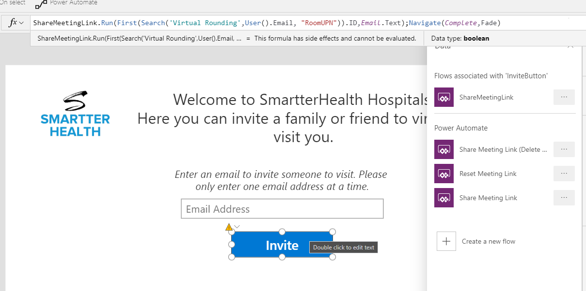
7. Save and republish the app

## Branding Updates (Optional)

You will likely elect to replace logos within the Apps with your organization's logo, and also adjust the app's color scheme.

## Embedding the App in Teams for Your Providers and Rooms

If you wish to embed these Apps below directly in Teams, follow the below steps.  Otherwise, the apps may be interacted with via "traditional" Power Apps desktop applications, web browser links, etc. for providers and rooms.

1. On the Providers and Patients Power App, click "Edit Settings", and enable "Preload app for enhanced performance"

    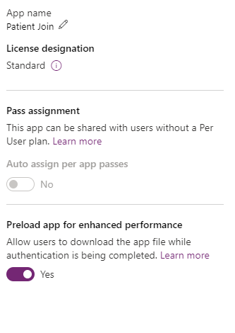

2. For the Providers and Patients App, click "Add to Teams". This will generate a .zip file for each.

    

3. Navigate to the "Teams Admin Center... Teams Apps... Manage apps"
4. Click "Upload new app" and upload each .zip file you just generated.  If you are unable to upload apps from here, check your "Org-wide app settings" and confirm that "Custom Apps" are enabled.
5. Navigate to "Permission Policies" for your App Permission Policies, and enable the "Patient Join" app to be published under "Tenant apps"

    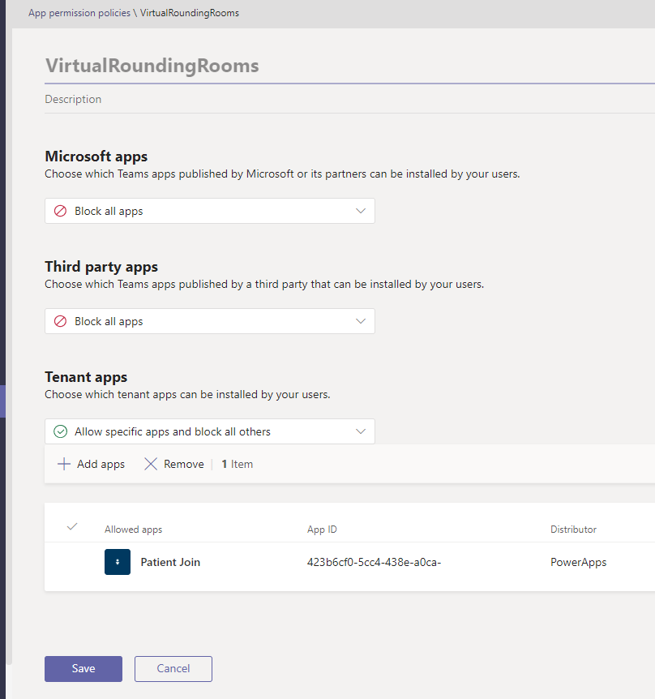

6. Go to your Virtual Rounding Room "Setup Policy" that you configured during the setup policy, and add the "Patient Join" app as a Power App to the profile.
7. If you wish to publish the Provider Power App, follow similar steps as above, but do not target the "Rooms" policies, but instead "Provider" policies you will need to create to support this scenario.
